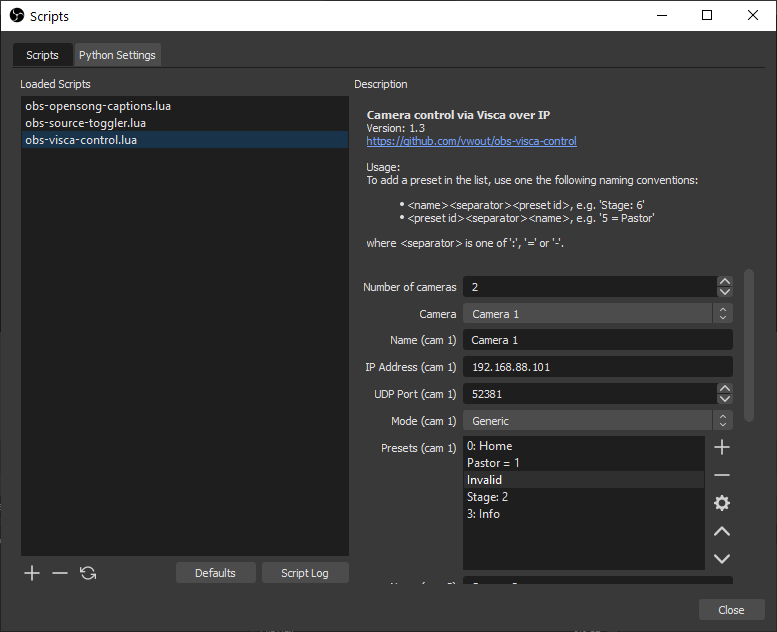
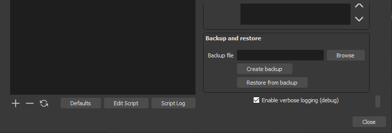
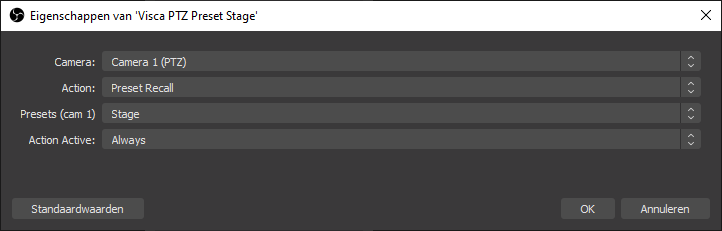
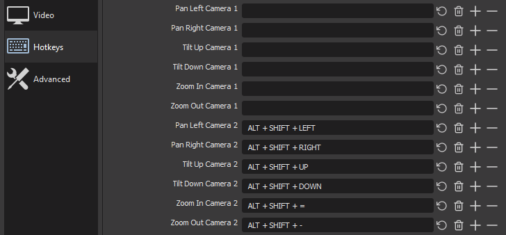

# obs-visca-control
A plugin for [OBS](https://obsproject.com/) to control Visca-over-IP based cameras.

This plugin adds a source to a scene in OBS. With this source, a camera can be controlled.
Its main purpose is to automatically switch a camera to a certain preset when the scene is activated.
This activation can be as soon as the scene is active in preview, in program, or both.

Besides recalling a pre-made preset, this plugin supports a few more control operations:
- Switch camera On
- Switch camera Off
- Preset Recall
- Set the camera to a defined (absolute) Pan/Tilt/Zoom position
- Zoom (Stop, In - Tele, Out - Wide, Direct)
- Pan/Tilt (Up, Down, Left, Right, Upleft, Upright, Downleft, Downright, Stop, Home, Reset)
- Focus (Manual mode, Automatic mode, Trigger refocus, To infinity, Near, Far)
- Change the camera image settings (Color gain / Saturation, Brightness)

This plugin requires the camera to support Visca over IP via UDP.
It follows the specification as designed by Sony and also supports the PTZOptics variant of Visca.
This plugin is confirmed to work with at Avonic, Canon, BZB Gear, Everet, GlowStream, JVC, PTZOptics and Zowietek cameras.
Others may work as well.

Also visit https://obsproject.com/forum/resources/control-visca-over-ip-based-cameras.1173/ for more information. 

## Installation
The plugin is a script plugin and utilizes the Lua scripting capabilities of OBS.
The script works on all recent versions of OBS, but version 28 or higher is recommended. 

To use the plugin, add the file `obs-visca-control.lua` as a script, see below for a detailed instruction.
The other `.lua` files in this repository are also required, but should not be added as scripts in OBS.

The files needed for usage if this plugin are:
- `obs-visca-control.lua`: The main OBS plugin file
- `libvisca.lua`: Internal library that implements the Visca communication
- `ljsocket.lua`: Network (socket) communication library for use with LuaJIT in OBS

Place the files on your computer, e.g. in `data\obs-plugins\frontend-tools\scripts\` under your OBS installation folder. 
In OBS choose *Scripts* in the *Tools* menu and click the "+" symbol. Navigate to the location where `obs-visca-control.lua` is stored and confirm with 'Open'. The plugin settings will show on the right as described in the below.

## Configuration
Before the plugin can be used in a scene, it requires configuration in the `Script` dialog.

Start by enumerating the number of cameras that you want to control.
For each camera a set of configuration properties will be shown.

### Camera settings
- _Name_: A friendly name for easy recognition of the camera.
- _Version Info_: The model, type and firmware (in case available and supported).
- _Address_: The IP address at which the camera is available.
- _Port_: The plugin by default uses _UDP_ port `52381`. 
Change this port when needed, e.g. to `1259` for a PTZOptics camera. 
Setting the port does not change the Visca dialect ('protocol') that is used.
Also check the _Mode_.
- _Mode_: The operating mode of the plugin. The default is `Generic`, which follows the original (Sony) Visca specification. Other supported modes are `PTZOptics`, to send commands according the PTZOptics Visca protocol.
- _Hotkey Pan/Tilt speed_: The speed that is used for pan and tilt operations triggered by a hotkey. This speed can be manipulated by user-assignable hotkeys.
- _Hotkey Zoom/Focus speed_: The speed that is used for zoom and focus operations triggered by a hotkey. This speed can be manipulated by user-assignable hotkeys.
- _Presets_: The list of presets that you want to configure for the camera - these need to match the presets that are configured in the camera itself.

**Important: Reload the script after changing the address, port of mode configuration!**

Switch between cameras using the drop-down.
Reload the plugin to update the names of the cameras in the camera drop-down list.

The preset list contains one preset per line and contains the name for the preset and the number of the preset stored in the camera.
The preset follows a specific syntax to link a preset number to a name. The following forms are supported:
- `<name>` `<separator>` `<preset number>`
- `<preset number>` `<separator>` `<name>`

The separator can be `:`, `=` or `-`.
Valid examples are `0: Home`, `5 = Pastor` or `Stage - 6`.
The number of presets that are supported may vary from camera to camera. This script supports up to preset number 254.

**Note:** Most cameras refer to the first preset as 1, other use 0.
The presentation on the interface of the camera might not be clear on this topic, so keep this in mind while testing presets.
JVC camera models are known to demonstrate this behavior.

### Backup

The bottom part of the plugin configuration settings section provides the ability to back up (export) the plugin settings to a 'json' file, restore (import) settings from a backup file.
This backup only contains the plugin configuration settings, thus the camera and preset configuration.
The scene settings are stored with each scene.

### Troubleshooting
In case of interaction problems between this plugin and a camera, it might be of use to enable `Enable verbose (debug) logging`.
The possible settings are `None` (no logging), `Info` (internal status information) and `Debug` (detailed data including raw Visca protocol messages).
This will provide detailed information about the plugin functionality in the `Script Log`.
Activate verbose logging using the setting `Debug` and attach the log when reaching out for help via the OBS forum or when [creating an issue](//github.com/vwout/obs-visca-control/issues).

## Usage
### In a scene
To control a camera, add a `Visca Camera Control` source to a scene.

In the source settings, select the camera and the action that should be executed.
- _Camera_: The camera configured in the plugin (see [configuration](#configuration))
- _Action_: Select the action that needs to be executed
  - When a camera supports standby mode, `Power On/Off` can be used in a scene to activated or suspend te camera.
  - The action `Image Settings` configures the Color Gain (Saturation) and/or Brightness.
  The current setting is automatically retrieved from the camera when this action is chosen.
  To show the value, hit the 'Defaults' button and select the 'Image Settings' action again.
  To set one of the settings, check the configuration item and change the slider value.
  Note: Your camera may not support all values that can be configured by the sliders.
  - When the action `Preset Recall` is chosen, the preset also needs to be chosen.
  These presets need to be configured per camera in the script settings, see [configuration](#configuration).
  - To not recall a predefined preset, but set the camera to an absolute position, choose `Pan/Tilt/Zoom Absolute position` and retrieve the current position of the camera to be recalled later by pressing the button.
  - For the action `Pan/Tilt Direction`, the camera will move in the configured direction. The direction and speed also needs to be selected. 
  Note that this action does not use a specific starting position, the pan action starts from the camera position that is actual when the scene becomes active.
  - For `Zoom In` and `Zoom Out`, the animation speeds determines the zoom speed.
  - The `Custom Command` action allows sending a custom Visca command to the camera at activation or deactivation of a scene.
See [Custom Command action execution overview](#custom-command-action-execution-overview) for details on how custom command actions are processed. 
This command must be in the documentation of the camera and consists of a series of hexadecimal values.
When these values are not know, or the manual is not understood, don't use this action.
- _Action Active_: The camera action is executed when either the scene in which the source is used becomes active in preview, in program, or both, depending on the selected entry in the selection.
- To make sure that a preview does not change settings of a camera that is on program.
Select the checkbox 'Run action on preview only when the camera is exclusive on preview, not active on program' ('on preview exclusive').
**Note**: Apply action _on preview exclusive_ when running OBS in Studio Mode, otherwise the action will never be executed. 
- _Delay Action_: When not set (left to 0), the action is immediately executed when the scene becomes active.
To delay the action execution, for example to synchronize after completion of a transition, set it to the number of milliseconds to wait.
This delay can also be used to run multiple actions in sequence

Camera actions configured for a scene are executed as configured when the scene is activated or deactivated on preview or on program.

**Tip**: To temporarily suppress execution of scene actions, configure the hotkey <a name="suppress_actions_on_scenes">`Suppress actions on scenes`</a>.
As long as the hotkey is pressed, actions are not executed.
To permanently disable execution, without removing the configuration, change the visibility of the `Visca Camera Control` source in the scene to `hidden`. 

#### Custom Command action execution overview

|                                                                          | Load scene on preview | Transition to program | Transition back to preview | Unload scene on preview2 |
|--------------------------------------------------------------------------|-----------------------|-----------------------|----------------------------|-------------------------------------|
| **Action Active**: Always **On preview exclusive**: No               | Send start command    | Send start command    | Send stop command          | Send stop command                   |
| **Action Active**: Always **On preview exclusive**: Yes1  | -                     | Send start command    | Send stop command          | -                                   |
| **Action Active**: Preview **On preview exclusive**: No              | Send start command    | -                     | -                          | Send stop command                   |
| **Action Active**: Preview **On preview exclusive**: Yes1 | -                     | -                     | -                          | -                                   |
| **Action Active**: Program **On preview exclusive**: N/A             | -                     | Send start command    | Send stop command          | -                                   |

Notes:
- 1 This only applies when the checkbox 'Run action on preview only...' is checked *and* for the same camera a Visca action is active (visible) on program.
In case no Visca camera is active on program, or a different Visca camera is active, the table result for 'No' apply.
- 2 The scene unload is executed when another scene is selected on preview. 
The camera multiview acts as multiple preview screens. When the multiview window is closed, stop actions are also executed for all scenes visible in multiview.

### Hotkeys
The plugin adds a number of hotkeys to the global OBS settings.
All hotkeys apply to a specific camera, except for [Suppress actions on scenes](#suppress_actions_on_scenes) (see the previous paragraph).
Presets 0-9 recall, Color Gain (Saturation) increase/decrease, Brightness increase/decrease, Pan/Tilt actions up/down/left/right and Zoom in/out can be activated via hotkey next to (in addition) to a scene action.
These hotkeys are independent of scene actions and can be applied at any moment.
Focus commands can only be called via a hotkey.
The pan/tilt and zoom/focus hotkey commands use the speed that is configured per camera in the [configuration](#configuration).
This (default) speed can be changed dynamically using a hotkey. 

To use any of these actions, configure a hotkey in the global OBS settings.

Pressing the configured key combination will perform an immediate zoom, pan or tilt step at the camera.
The amount of effective zoom, pan, tilt or focus change may vary from camera to camera.
When any of the focus commands is used, the camera will be switched to manual focus (except for the command to switch to automatic mode).
The actions will obviously only be executed when the camera actually supports zooming, panning or tilting. 

# Credits
This plugin uses [luajitsocket](https://github.com/CapsAdmin/luajitsocket/), a library that implements socket support for LuaJIT, since the Lua socket library is not available in OBS.
